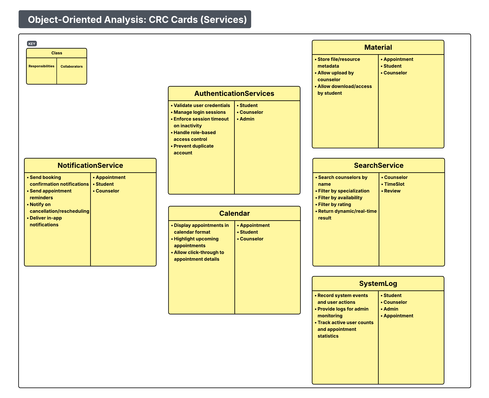
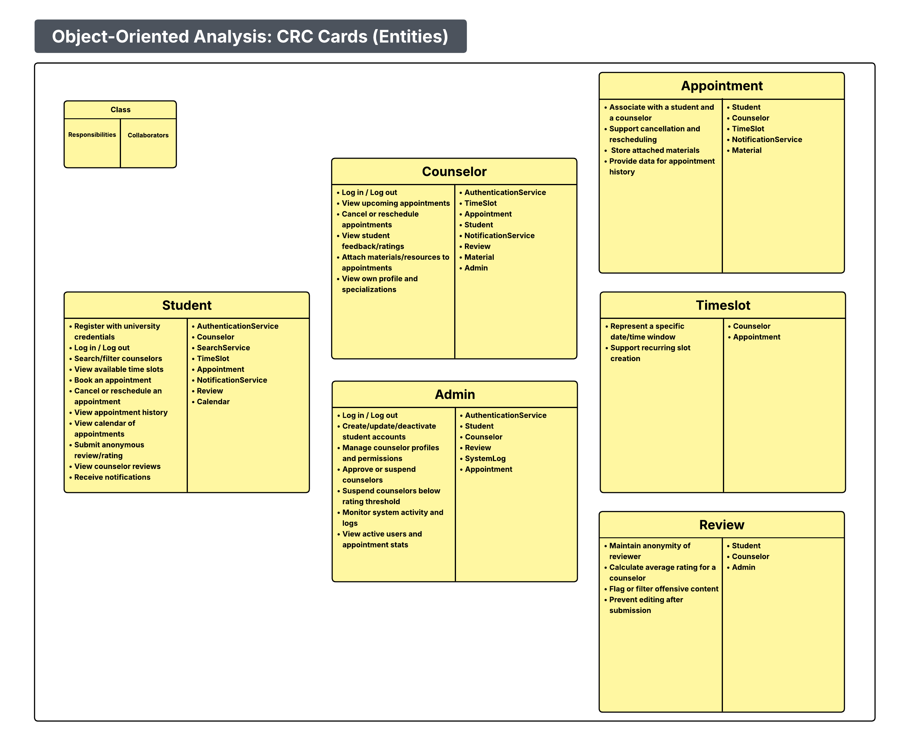
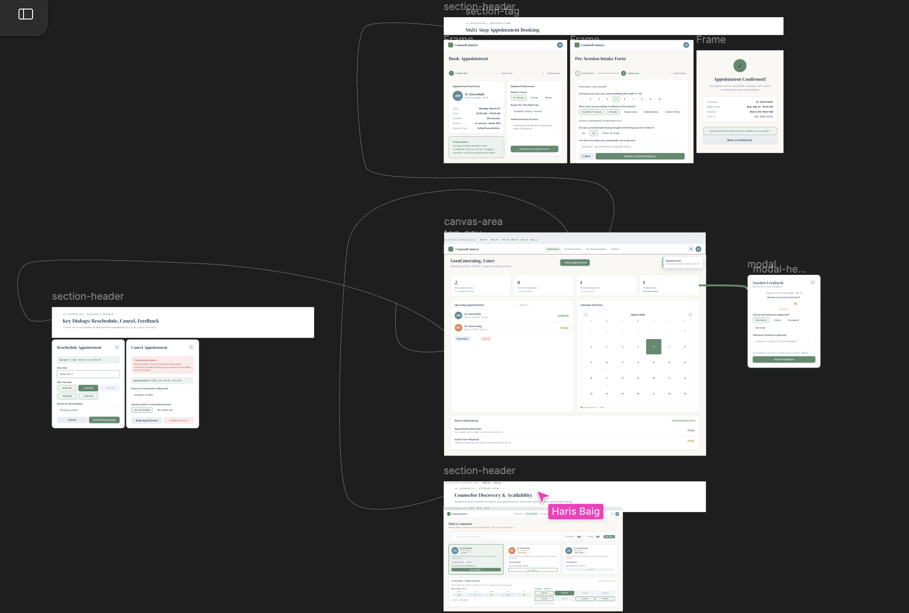
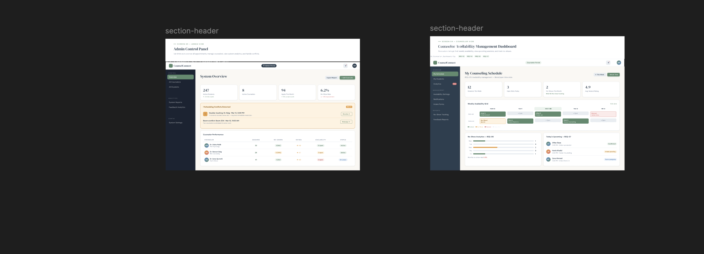

# Project Documentation

## Table of Contents
- [Team Information](#team-information)

- [Meeting Minutes](#meeting-minutes)
  - [Meeting – March 6, 2026](#meeting--march-6-2026)
  - [Meeting – TBD](#meeting--tbd)

- [Object-Oriented Analysis — CRC Cards](#object-oriented-analysis--crc-cards)

- [Product Backlog](#product-backlog)
  - [Product Backlog – Project Part 1](#product-backlog--project-part-1)
  - [Product Backlog – Project Part 2](#product-backlog--project-part-2)
  - [Product Backlog – Project Part 3](#product-backlog--project-part-3)

- [Wireframes](#wireframes)
  - [Wireframes – Project Part 1](#wireframes--project-part-1)
  - [Wireframes – Project Part 2](#wireframes--project-part-2)

  - [Wireframes – Project Part 3](#wireframes--project-part-3)

---

## Team Information
- **Team Name:** gitgud

| Name               | Roll Number |   GitHub ID   |
|--------------------|-------------|---------------|
| Affan Khalid       | 27100104    | AffanKhalid06 |
| M. Moosa Kashif    | 27100451    | MoosaKashif   |
| Tayab Javaid       | 27100188    | TayabJavaid   |
| Muhammad Haris     | 27100205    | baigharis7    |
| Umer Mahmood Shafi | 27100091    | Umer-2020     |

---

## Meeting Minutes

### Meeting – March 6, 2026

#### Attendance
- Umer Mahmood Shafi  
- Muhammad Haris  
- Tayab Javaid  
- M. Moosa Kashif 
- Affan Khalid

---

#### Key Takeaways
- Document meeting minutes for **every meeting** going forward.
- Ensure assignments are **evenly divided** and all members contribute to **all areas** (wiki, code, design, etc.).
- UML guidelines:
  - Controllers should be explicitly represented.
  - Model classes should be simple POJOs.
  - All CRUD operations belong in controller classes.
- Storyboard requirements:
  - Must be **fully documented** and submitted in **picture form**.
  - A **complete, high-level storyboard** is required.
  - Additional videos or smaller feature storyboards may be submitted alongside.
- Experiment search should be implemented in a **controller class**, not a static class.
- Storyboard must include **Experiment Search** and **Experiment execution flow**.

---

#### Prepared Questions & Decisions

**Issue #1**
- Description limit → No  
- Additional experiment validation → No  

**Issue #4**
- Map API restrictions → No, implementation detail  

**Issue #7**
- Resume ended experiment → Not required  

**Issue #9**
- Modify trials → Not required  

**Issue #11**
- Plot type → Scatter plot (data over time)  

**Issue #14**
- Question text length → No limit  
- Displayed fields → Designer’s choice  

**Issue #15**
- Typos in user story → Yes  
- Reply depth → Designer’s choice (1 level sufficient)  

**Issue #18**
- Subscription handling → Follow-up required  
- Scan method → Team choice (recommended within experiment)  
- QR Code stores:
  - Location
  - Experiment ID
  - Success / failure
  - Non-negative values; measurement optional  

**Issue #19**
- Barcode same as QR code  
- Barcode data must be stored on server  

**Issue #23**
- Search performance / real-time updates → Designer’s choice  

---

#### General Notes
- Maintain consistent formatting for user stories and storyboards.
- Submit **one main storyboard** (high-level).
- Storyboard does not need to be visually polished.
- Supplementary videos and feature storyboards are allowed.
- Presentation:
  - 10 minutes per group
  - Dataset generated by team
- No strict requirements — apply reasonable design judgment.

---

#### Action Items
- [ ] Maintain meeting minutes for every meeting  
- [ ] Finalize and document complete storyboard  
- [ ] Align UML diagrams with controller/model guidelines  
- [ ] Implement experiment search in controller  

---

### Meeting – TBD
_Content to be added._

---

## Object-Oriented Analysis — CRC Cards

---

## Product Backlog

### Product Backlog – Project Part 1
Project Part 1 did not include making a backlog

### Product Backlog – Project Part 2
| ID | User Story | Story Point | Risk | Halfway Release |
|----|------------|-------------|------|-----------------|
|01|As a student, I want to register for an account using my university credentials so that I can request counseling sessions|2|High|Yes|
|02|As a student, I want to log in securely so that my personal information (like appointment data) is protected|1|High|Yes|
|03|As a student, I want to view available counseling slots so that I can choose a suitable time|1|Low|Yes|
|04|As a student, I want to book a counseling appointment so that I can receive guidance and/or support|3|Low|Yes|
|05|As a student, I want to cancel or reschedule an appointment so that I can manage the conflicts in my schedule|5|Medium|No|
|06|As a student, I want to be able to review and rate my counseling session anonymously so that I can provide feedback about the counselor|3|Medium|No|
|07|As a student, I want to be able to view the reviews of a counselor so that I can ascertain the best of my options|5|Low|No|
|08|As a student, I want to receive appointment notifications so that I don’t miss my session|5|Medium|No|
|09|As a student, I want to be able to passively keep track of appointments using a calendar|5|Low|No|
|10|As a student, I want to be able to search/filter through the available list of counselors by their specializations or availability, so I can find the most suitable person|2|Low|Yes|
|11|As a student, I want to view my appointment history so that I can keep track of past sessions|2|Low|Yes|
|12|As a counselor, I want to log in so that I can manage my appointments|1|High|Yes|
|13|As a counselor, I want to set/update my availability so that students can book sessions|2|Medium|Yes|
|14|As a counselor, I want to view my upcoming appointments so that I can prepare in advance|2|Low|Yes|
|15|As a counselor, I want to view the students’ feedback and their ratings so I can improve my shortcomings|2|Low|No|
|16|As a counselor, I want to cancel or reschedule appointments if necessary so that students can be notified|5|Medium|No|
|17|As a counselor, I want to have the option of being able to list relevant material for an appointment|13|High|No|
|18|As an admin, I want to create, update, or deactivate student accounts so that I can ensure organization|8|High|No|
|19|As an admin, I want to manage counselor profiles and their permissions so that only authorized counselors can book|8|High|No|
|20|As an admin, I want to stop a counselor from taking appointments if their reviews fall below a threshold|8|Medium|No|
|21|As an admin, I want to monitor system activity so I can ensure proper functioning|13| High|No|

### Product Backlog – Project Part 3
| ID | User Story | Priority | Status |
|----|------------|----------|--------|
| 01 | As a student, I want to register for an account using my university credentials so that I can request counseling sessions | High | Completed |
| 02 | As a student, I want to log in securely so that my personal information (like appointment data) is protected | High | Completed |
| 03 | As a student, I want to view available counseling slots so that I can choose a suitable time | Low | Completed |
| 04 | As a student, I want to book a counseling appointment so that I can receive guidance and/or support | Low | Completed |
| 05 | As a student, I want to cancel or reschedule an appointment so that I can manage the conflicts in my schedule | Medium | To Do |
| 06 | As a student, I want to be able to review and rate my counseling session anonymously so that I can provide feedback about the counselor | Medium | To Do |
| 07 | As a student, I want to be able to view the reviews of a counselor so that I can ascertain the best of my options | Low | To Do |
| 08 | As a student, I want to receive appointment notifications so that I don’t miss my session | Medium | To Do |
| 09 | As a student, I want to be able to passively keep track of appointments using a calendar | Low | To Do |
| 10 | As a student, I want to be able to search/filter through the available list of counselors by their specializations or availability, so I can find the most suitable person | Low | Completed |
| 11 | As a student, I want to view my appointment history so that I can keep track of past sessions | Low | Completed |
| 12 | As a counselor, I want to log in so that I can manage my appointments | High | Completed |
| 13 | As a counselor, I want to set/update my availability so that students can book sessions | Medium | Completed |
| 14 | As a counselor, I want to view my upcoming appointments so that I can prepare in advance | Low | Completed |
| 15 | As a counselor, I want to view the students’ feedback and their ratings so I can improve my shortcomings | Low | To Do |
| 16 | As a counselor, I want to cancel or reschedule appointments if necessary so that students can be notified | Medium | To Do |
| 17 | As a counselor, I want to have the option of being able to list relevant material for an appointment | High | To Do |
| 18 | As an admin, I want to create, update, or deactivate student accounts so that I can ensure organization | High | To Do |
| 19 | As an admin, I want to manage counselor profiles and their permissions so that only authorized counselors can book | High | To Do |
| 20 | As an admin, I want to stop a counselor from taking appointments if their reviews fall below a threshold | Medium | To Do |
| 21 | As an admin, I want to monitor system activity so I can ensure proper functioning | High | To Do |

---

## Wireframes

### Wireframes – Project Part 1
_Add screenshots or links to wireframe images._

### Wireframes – Project Part 2
Figma Link: https://www.figma.com/design/lBmBmam8cPsedxzZHFOvHT/Untitled?node-id=0-1&t=zVeL3bU7puA0neHP-1

### Wireframes – Project Part 3
_Add screenshots or links to wireframe images._
